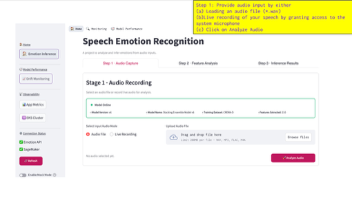
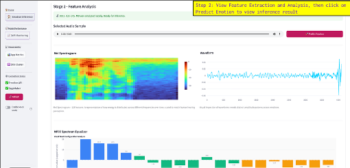
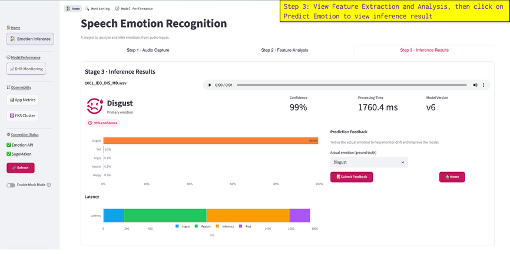

# Machine Learning Speech Emotion Recognition

## Jupyter Notebook & Model Training Setup
INSTRUCTIONS TO RETRAIN THE MODELS IN ITS ENTIRETY (TAKES 3-4HRS TO RUN)  
*NOTE:* Due to the number of experiments that you have to run, each notebook will take 3-4 hours to run.

1. git clone https://github.com/sagerstack/ml-speech-emotion-recognition.git  
2. Download CREMA-D Dataset:  
   - Navigate to https://drive.google.com/drive/folders/1tvWeyxZM0bvKVhogRD1yCnwnpgOScJet?usp=share_link  
   - Download `AudioWAV` folder in its entirety, and place the folder in `notebooks/AudioWAV`.  
   - Alternatively, you may download CREMA-D Dataset from: https://www.kaggle.com/datasets/ejlok1/cremad  
   - Ensure you unzip the audio files into `notebooks/AudioWAV` directory.  
3. Install required python packages: `pip install -r requirements.txt`  
4. Open `PART A - Baseline Models.ipynb` or `PART B - Systematic Improvements.ipynb` in Jupyter Notebook.  
5. Run all cells in order (Kernel → Restart & Run All).  
6. Training results and plots will be displayed at the end.

## Project Overview
End-to-end speech emotion recognition system with:
- FastAPI backend (Clean Architecture) serving local and SageMaker-hosted models
- Streamlit frontend for uploads, inference visualization, monitoring, and history
- Jupyter notebooks for model development and experimentation
- Deployment stacks for Docker Compose, Kubernetes, and AWS SageMaker

## Repository Layout
- `notebooks/`: Model experimentation (`PART A - Baseline Models.ipynb`, `PART B - Systematic Improvements.ipynb`)
- `backend/`: FastAPI service, monitoring, and tests (see `backend/README.md`)
- `frontend/streamlit_app/`: Streamlit UI for inference and monitoring
- `deployment/`: Docker, K8s manifests, monitoring stack, and SageMaker container
- `sagemaker/`: SageMaker deployment notebooks, scripts, and docs
- `scripts/`: Utility scripts (S3 upload, local deploy, terraform helpers)
- `docs/` and `specs/`: Architecture, operations, and feature specs

## Quickstart (Inference Stack)
- Prereqs: Docker and Docker Compose.
- Build and run backend + Streamlit locally:
  ```bash
  docker-compose up --build backend streamlit
  ```
- Backend: http://localhost:8000 (`/docs` for OpenAPI)  
- Frontend: http://localhost:8501

## ML Application Setup For Local Inference & Testing
- For full local setup and execution steps, follow [user-guide-local-setup.md](docs/user-guides/user-guide-local-setup.md).

### How to Access the App and Important URLs
- Streamlit UI: http://localhost:8501 (or the port you configured in the guide)  
- API docs: http://localhost:8000/docs  
- Health check: http://localhost:8000/health  
- If running via Minikube, use the service URLs listed in the local setup guide.

### Running Inference
- In the Streamlit UI, click **Emotion Inference**.  
- **Step 1 – Audio input:** Upload an audio file or record live audio, then click **Analyze Audio**.  
    
- **Step 2 – Feature analysis:** Inspect waveform, mel spectrogram, MFCCs, and prosodic features generated locally.  
    
- **Step 3 – Predict emotion:** Review predicted emotion and probability chart; submit feedback with the actual emotion to improve drift monitoring (available when the backend is online).  
    
- Repeat with multiple samples to populate monitoring buffers and history.

### Drift Monitoring
- Open **Drift Monitoring** in the Streamlit sidebar to view the Evidently summary, buffered counts, and latest HTML report.  
- Current local workflow: log ~10 predictions (ideally with feedback) to fill the buffer, then trigger a fresh report:  
  ```bash
  curl -X POST http://localhost:8000/v1/monitoring/generate
  ```  
- After generation, **Drift Monitoring** page will automatically pull the latest summary and any reports already generated 
 
- Note: In production this step is automated when the buffer crosses configured thresholds (e.g., auto-generate at 100 predictions; buffer max 500).

### Observability

- Launch the two pre-configured Grafana dashboards from the UI using the following links: **App Metrics** (application metrics) and **EKS Cluster** (cluster/runtime health).  
- Prometheus expression browser (raw metrics): http://localhost:9090 (when monitoring stack is running).

## Additional Documentation
- Detailed architecture, workflows, and user stories live in `docs/` and `specs/`.
- CI/CD pipelines are defined in `.github/workflows/`.
