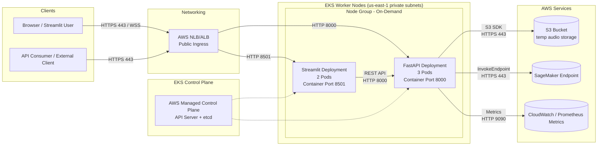

# AWS EKS Deployment Diagram

### Diagram Notes

- **Ingress / Load Balancer**: An AWS Application or Network Load Balancer terminates TLS and routes traffic to the appropriate service inside the EKS cluster.
- **Streamlit Pods**: Serve the ML UI on port 8501. They reach the backend using the cluster service (`http://backend:8000`).
- **FastAPI Backend Pods**: Provide `/v1/infer/infer` and supporting APIs on port 8000. They connect to AWS resources (S3 for temporary audio storage, SageMaker for inference, CloudWatch/Prometheus for metrics) over HTTPS.
- **Control Plane**: Managed by AWS; communicates with worker nodes to schedule pods and manage cluster state.
- **Metrics**: Pods expose `/metrics` on port 9090 for Prometheus scraping; CloudWatch handles infrastructure logs/metrics.
