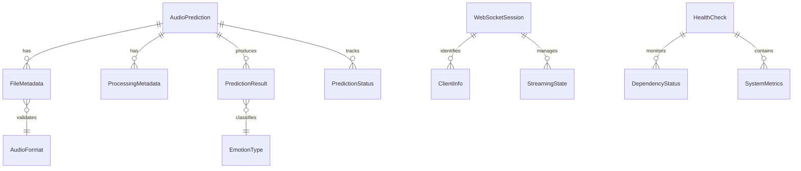

# Data Model

## Core Entities

### Audio Prediction

Represents a single emotion analysis request with audio input, processing metadata, and prediction results.

```python
class AudioPrediction(BaseModel):
    request_id: str = Field(default_factory=lambda: str(uuid.uuid4()))
    audio_format: AudioFormat
    file_metadata: FileMetadata
    processing_metadata: ProcessingMetadata
    prediction_result: Optional[PredictionResult]
    status: PredictionStatus
    created_at: datetime = Field(default_factory=datetime.utcnow)
    updated_at: datetime = Field(default_factory=datetime.utcnow)
```

### File Metadata

Audio file information extracted during upload.

```python
class FileMetadata(BaseModel):
    original_filename: str
    file_size_bytes: int = Field(..., lt=30_000_000)  # 30MB limit
    duration_seconds: float = Field(..., lt=30.0)  # 30s limit
    sample_rate: int = Field(..., ge=16000, le=48000)  # Flexible 16-48kHz
    channels: int = Field(..., ge=1, le=2)  # Mono or stereo
    bit_rate: Optional[int] = None
    format_validation: FormatValidation
```

### Audio Format

Supported audio formats with validation.

```python
class AudioFormat(str, Enum):
    WAV = "wav"
    MP3 = "mp3"
    M4A = "m4a"

class FormatValidation(BaseModel):
    is_valid: bool
    detected_format: Optional[AudioFormat]
    magic_bytes_match: bool
    corruption_detected: bool
    validation_errors: List[str] = []
```

### Processing Metadata

Metadata about the audio processing pipeline.

```python
class ProcessingMetadata(BaseModel):
    preprocessing_time_ms: float
    model_inference_time_ms: float
    total_processing_time_ms: float
    preprocessing_steps: List[str]
    sample_rate_preserved: bool
    channels_preserved: bool
    temporary_files_created: int
    memory_peak_mb: float
```

### Prediction Result

Model prediction output with confidence scores.

```python
class PredictionResult(BaseModel):
    emotion: EmotionType
    confidence: float = Field(..., ge=0.0, le=1.0)
    all_emotions: Dict[EmotionType, float]
    model_version: str
    endpoint_name: str
    inference_id: str
    processed_at: datetime

class EmotionType(str, Enum):
    HAPPY = "happy"
    SAD = "sad"
    ANGRY = "angry"
    FEARFUL = "fearful"
    DISGUSTED = "disgusted"
    NEUTRAL = "neutral"
```

### Prediction Status

Status tracking for prediction requests.

```python
class PredictionStatus(str, Enum):
    PENDING = "pending"
    PROCESSING = "processing"
    COMPLETED = "completed"
    FAILED = "failed"
    TIMEOUT = "timeout"
    CANCELLED = "cancelled"

class FailureReason(BaseModel):
    error_type: str
    error_message: str
    retry_possible: bool
    suggested_action: Optional[str]
    error_code: str
```

### WebSocket Session

Manages real-time audio streaming sessions.

```python
class WebSocketSession(BaseModel):
    session_id: str = Field(default_factory=lambda: str(uuid.uuid4()))
    connection_id: str
    client_info: ClientInfo
    streaming_state: StreamingState
    audio_chunks_received: int
    total_audio_size_bytes: int
    session_start_time: datetime
    last_activity_time: datetime
    status: WebSocketStatus

class ClientInfo(BaseModel):
    user_agent: str
    ip_address: str
    connection_timestamp: datetime
    protocol_version: str

class StreamingState(BaseModel):
    is_streaming: bool
    current_chunk_sequence: int
    expected_chunks: Optional[int] = None
    received_chunks: int = 0
    buffer_size_bytes: int = 0
    processing_started: bool = False

class WebSocketStatus(str, Enum):
    CONNECTED = "connected"
    STREAMING = "streaming"
    PROCESSING = "processing"
    COMPLETED = "completed"
    DISCONNECTED = "disconnected"
    ERROR = "error"
```

### Health Check

System health and dependency status.

```python
class HealthCheck(BaseModel):
    status: SystemStatus
    timestamp: datetime = Field(default_factory=datetime.utcnow)
    uptime_seconds: float
    version: str
    dependencies: Dict[str, DependencyStatus]
    metrics: SystemMetrics

class SystemStatus(str, Enum):
    HEALTHY = "healthy"
    DEGRADED = "degraded"
    UNHEALTHY = "unhealthy"

class DependencyStatus(BaseModel):
    name: str
    status: ServiceStatus
    response_time_ms: Optional[float] = None
    last_check: datetime
    error_details: Optional[str] = None

class ServiceStatus(str, Enum):
    UP = "up"
    DOWN = "down"
    DEGRADED = "degraded"
    TIMEOUT = "timeout"

class SystemMetrics(BaseModel):
    active_websocket_connections: int
    requests_per_minute: float
    average_response_time_ms: float
    error_rate_percent: float
    memory_usage_percent: float
    cpu_usage_percent: float
    disk_usage_percent: float
```

### API Metrics

Request/response tracking for monitoring.

```python
class APIMetrics(BaseModel):
    request_id: str
    endpoint: str
    method: str
    status_code: int
    response_time_ms: float
    request_size_bytes: int
    response_size_bytes: int
    user_agent: str
    ip_address: str
    correlation_id: str
    timestamp: datetime
    error_details: Optional[str] = None

class WebSocketMetrics(BaseModel):
    session_id: str
    connection_duration_seconds: float
    total_chunks_transferred: int
    total_bytes_transferred: int
    average_chunk_time_ms: float
    disconnection_reason: Optional[str] = None
    client_error_count: int
    server_error_count: int
```

## Entity Relationships



## Data Flow Patterns

### Prediction Request Flow

1. **File Upload** → `FileMetadata` extraction and validation
2. **Processing** → `ProcessingMetadata` collection during audio preprocessing
3. **Inference** → `PredictionResult` generation from SageMaker
4. **Completion** → `AudioPrediction` status update with all metadata

### WebSocket Flow

1. **Connection** → `WebSocketSession` creation with `ClientInfo`
2. **Streaming** → `StreamingState` updates as chunks arrive
3. **Processing** → Convert to `AudioPrediction` for model inference
4. **Completion** → Session cleanup and metrics collection

### Health Check Flow

1. **Dependency Checks** → `DependencyStatus` for each service
2. **Metrics Collection** → `SystemMetrics` from Prometheus
3. **Aggregation** → `HealthCheck` with overall system status

## Validation Rules

### Audio File Validation

- **Size**: Must be < 30MB (30,000,000 bytes)
- **Duration**: Must be < 30 seconds
- **Sample Rate**: 16-48kHz (flexible as per requirements)
- **Channels**: 1-2 channels (mono/stereo)
- **Format**: WAV, MP3, M4A only
- **Integrity**: No corruption detected in magic bytes

### Prediction Validation

- **Confidence**: Must be between 0.0 and 1.0
- **Emotions**: Must sum to 1.0 (or close due to floating point)
- **Model Version**: Must be valid semantic version
- **Response Time**: Must be < 2000ms for P95 requirement

### WebSocket Validation

- **Chunk Size**: Must be consistent 1-second audio chunks
- **Sequence**: Must maintain sequential order
- **Timeout**: Must handle 30-second processing timeout
- **Memory**: Must not exceed buffer limits

## State Management

### In-Memory State

- **Active Sessions**: WebSocket connections and prediction state
- **Rate Limiting**: Per-client request tracking
- **Metrics Collection**: Real-time performance data

### Temporary State

- **Audio Files**: Stored temporarily during processing, auto-cleaned
- **Session Data**: Maintained for active WebSocket connections
- **Cache**: Optional response caching for duplicate requests

### Persistent State (Future)

- **Metrics History**: Long-term performance data (CloudWatch)
- **Error Logs**: Structured logs with correlation IDs
- **Audit Trail**: Request/response tracking for compliance